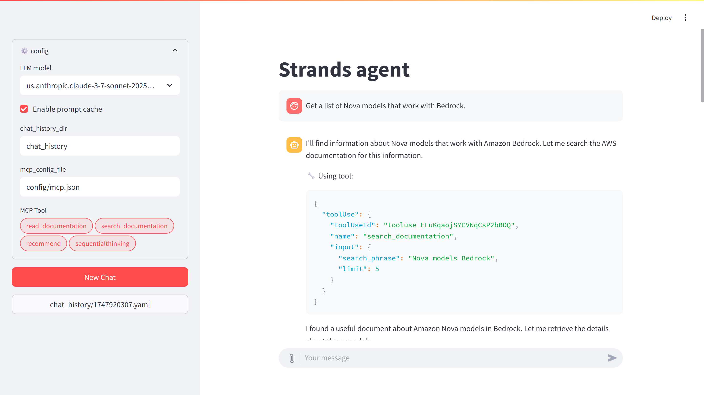

# Strands Agent Streamlit Chat App

A Streamlit-based chat application for interacting with AI agents powered by the Strands framework and AWS Bedrock models.



## Overview

This application provides a chat interface for interacting with various large language models (LLMs) through AWS Bedrock. It supports:

- Multiple AWS Bedrock models (Claude, Nova)
- Image input and processing (for models that support it)
- Tool usage through MCP (Model Context Protocol)
- Chat history management
- Prompt caching for improved performance

## Features

- **Multiple Model Support**: Choose from various AWS Bedrock models including Amazon Nova and Anthropic Claude models
- **Image Processing**: Upload and process images with models that support image input
- **Tool Integration**: Use external tools through MCP (Model Context Protocol)
- **Chat History**: Save and load previous conversations
- **Prompt Caching**: Optimize performance with configurable prompt caching

## Prerequisites

- Python 3.12 or higher
- AWS account with Bedrock access
- Properly configured AWS credentials
- Docker (for some MCP tools)

## Installation

1. Clone the repository:
   ```
   git clone https://github.com/moritalous/strands-agent-streamlit-chat.git
   cd strands-agent-streamlit-chat
   ```

2. Install dependencies:
   ```
   pip install -e .
   ```
   
   Or using uv:
   ```
   uv pip install -e .
   ```

## Configuration

The application uses two main configuration files:

### 1. `config/config.json`

Contains settings for:
- Chat history directory
- MCP configuration file path
- AWS Bedrock region
- Model configurations including:
  - Cache support options
  - Image support capability

Example:
```json
{
    "chat_history_dir": "chat_history",
    "mcp_config_file": "config/mcp.json",
    "bedrock_region": "us-east-1",
    "models": {
        "us.amazon.nova-premier-v1:0": {
            "cache_support": [],
            "image_support": true
        },
        "us.anthropic.claude-3-7-sonnet-20250219-v1:0": {
            "cache_support": [
                "system",
                "messages",
                "tools"
            ],
            "image_support": true
        }
    }
}
```

### 2. `config/mcp.json`

Configures MCP (Model Context Protocol) servers for tool integration:

Example:
```json
{
    "mcpServers": {
        "awsdoc": {
            "command": "uvx",
            "args": [
                "awslabs.aws-documentation-mcp-server@latest"
            ],
            "env": {
                "FASTMCP_LOG_LEVEL": "ERROR"
            }
        },
        "sequentialthinking": {
            "command": "docker",
            "args": [
                "run",
                "--rm",
                "-i",
                "mcp/sequentialthinking"
            ]
        }
    }
}
```

## Usage

1. Start the Streamlit application:
   ```
   streamlit run app.py
   ```

2. In the web interface:
   - Select a model from the dropdown in the sidebar
   - Enable/disable prompt caching as needed
   - Select which MCP tools to use
   - Start a new chat or continue an existing one
   - Type messages and optionally upload images
   - View tool usage in the chat interface

## Chat History

Chat histories are saved as YAML files in the configured chat history directory. You can:
- Start a new chat with the "New Chat" button
- Load previous chats by clicking on their filenames in the sidebar

## MCP Tools

The application supports various MCP tools:
- AWS Documentation tools
- Sequential thinking tools
- Additional tools can be added through the MCP configuration

## Development

The application is built with:
- Streamlit for the web interface
- Strands framework for agent capabilities
- AWS Bedrock for LLM access
- MCP for tool integration


## License

This project is licensed under the Apache License 2.0 - see the [LICENSE](LICENSE) file for details.

## Acknowledgements

- Strands Agents framework
- AWS Bedrock
- Streamlit
- MCP (Model Context Protocol)
